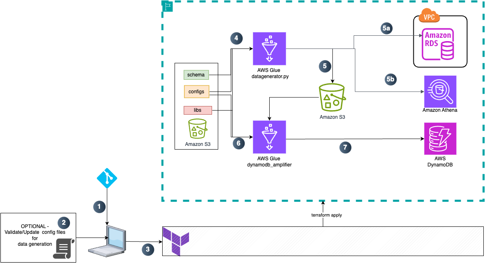

# syntheticdatagen_with_referrential_integrity

This is a solution to prepare synthetic data with referential integrity. With this, the generated fields adhere to primary key, foreign key relations across multiple tables and allows for alias field names in different tables. This solution is meant to be used in NON-PRODUCTION environments only. 

The solution also takes into account the order of insertion for each table as well. This will ensure table constraints are met if any when RDS is used as a datasink. 


NOTE:

1. If there are multiple aliases for same field in various tables, just reference the same variable for ex: department_id has an alias dept_id in another table. 

2. For scenarios where one field needs to vary based value of another, ensure you add that child key as the basecol in the generation. This ensures the generated key always is based on basecol key. For instance, a given employee should always belong to the same department. Hence employee id is provided as baseCol for department id generation. It will ensure that every row in any table with employee id will always get the same department id as generated value. 

3. Faker based ids will appear closer to realworld values but are not goverened by the rules of datagenerator above. Use it with caution and only when these values are not part of any join keys.




## [Optional] Local setup to test glue jobs:
https://docs.aws.amazon.com/glue/latest/dg/aws-glue-programming-etl-libraries.html#develop-local-docker-image
Step 1: docker pull amazon/aws-glue-libs:glue_libs_4.0.0_image_01
Step 2: Set below variables
``` export WORKSPACE_LOCATION=./ ```

Step 3: Start docker containers
$ docker run -it -v ~/.aws:/home/glue_user/.aws -v $WORKSPACE_LOCATION:/home/glue_user/workspace/ -e DISABLE_SSL=true --rm -p 4040:4040 -p 18080:18080 --name glue_pyspark amazon/aws-glue-libs:glue_libs_4.0.0_image_01 pyspark

Step 4:
Once the glue session starts, you can select "Remote Explorer" in left side panel within VSCode and choose glue_pyspark container

Step 5: After attaching to the running container run the below command to install dependencies
cd workspace
pip install -r requirements.txt

Step 7: Now you can test your file using
cd src/generators

Step 8:
export AWS_REGION=<Your region>
```spark-submit datagenerator.py```
Ensure the defaults available in the conf file have the appropriate settings for the values

Step 9:
For dynamodb generation, follow below steps to generate whl file for a dependency lib:
```
pip install wheel setuptools
mkdir nested_lookup_temp
pip show nested_lookup  
  from the above command check the Location and copy the contents from site-packages to temp directory

cd nested_lookup_temp
cp -r <your venv path>python3.11/site-packages/nested_lookup .  

Create a file setup.py within the temp folder 
python setup.py bdist_wheel
This will generate the whl file in the dist folder. 

Alternatively, the whl has been checked into the code repo with its contents
```


## For REMOTE EXECUTION:

### Terraform Execution Instructions:

The terraform code in this repository can we executed in two modes - with RDS and without RDS provisioning

In either modes, ensure that the AWS region is set in the `AWS_REGION` environment variable and terraform is installed on your local machine. Ensure that the terraform version installed is >= 1.9.7.

Lastly, create a ssh key pair and update the following terraform variables with the path to your private and public key files

    variable "private_key" {
    description = "Path to the private key"
    default = "<path to private ssh key"
    }

    variable "public_key" {
    description = "Path to the public key"
    default = "path to public ssh key"
    }

#### Provision infrastructure without RDS
    
    $ git clone  https://github.com/skopp002/syntheticdatagen_with_referrential_integrity.git
    $ cd syntheticdatagen_with_referrential_integrity/terraform
    $ vi variables. tf  (Edit the variables.tf file to make any changes to the input variables) 
    $ terraform init
    $ terraform plan
    $ terraform apply


To re-deploy any changes to the infrastrure, simply change the terraform code and then execute a `terraform plan` followed by `terraform apply`

By default, in the non-RDS mode the terraform code will provision the `datagenerator` and `dynamodb_generator` ETL jobs, a glue database, relavent s3 buckets and the needed IAM role and permissions. The ETL jobs when executed will automatically create the required dynamodb table. 

#### Provision infrastructure with RDS

If you wish to generate synthetic data for RDS, you can execute terraform in this mode. Please note that the in this mode terraform will additionally provision a VPC, an RDS instance, a secret of the RDS master user and an EC2 instance to create empty tables in the RDS database.

User are expected to 

1. Place the Data Definition (DDL) of there tables in `terraform/sql` in a single file with an `.sql` extension. 
2. Update the `inbound_ssh_connection_cidr` variable in `variables.tf`to provide the public IP address of the machine from where the terraform code is run
3. Update the `sql_file_path` variable in `variables.tf` to point to the user created SQL file

To run terraform code with RDS provisioning:

    $ git clone  https://gitlab.aws.dev/skoppar/syntheticdatagen_with_referrential_integrity
    $ cd syntheticdatagen_with_referrential_integrity/terraform
    $ vi variables. tf  (Edit the variables.tf file to make any changes to the input variables) 
    $ terraform init
    $ terraform plan -var="enable_rds=true"
    $ terraform apply -var="enable_rds=true"

#### Destroy infrastruture

To destroy the provisioning infrastructure: 

    $ terraform destroy (If provisoned initially in non-RDS mode)
    $ terraform destroy -var="enable_rds=true" (If provisioned initially in RDS mode)

### Glue job Execution instructions:

1. Once terraform pipeline executes successfully, ensure the glue jobs, libraries, schema for athena/RDS tables and the configurations for datagenerator and dynamodb_amplifier are available. Verify the paths correspond to the paths specified in runtime arguments of the glue jobs. For Athena as datasink, you do not need to create tables, Glue will create tables specified in the config, however database creation is needed. The terraform code will create the database. Ensure the database schema is created and has location set up. Without this you may encounter the error below (Troubleshooting:1)

2. Execute datagenerator glue job. This should generate specified number of rows for all the tables specified in the yaml file. 
The Datagenerator job needs to be executed first. If the requirement is only dynamodb amplification, you can generate a keypathfile manually and provide as input to dynamodb_amplifier job.  

3. Dynamodb amplification requires a different approach since load testing for dynamodb would entail multiple items with same primary key and varying sort key. The solution takes this into account and supports multiple ways to define a primary key, sort key and various other attributes which are part of the items. If only dynamodb amplification is desired, a sample keypathfile can be provided. The config file specifies patterns for Partition Key and Sort Key settings for Amazon DynamoDB table generation. It is recommended to create Amazon DynamoDB table through Terraform itself. However, there is a provision to create Amazon Dynamodb Table through Glue job. This code block has been commented to avoid security risk. 

    NOTE: If Amazon DynamoDB table is created through AWS Glue job, the table would not be automatically deleted. If it is created through Terraform, the table will automatically be deleted upon terraform destroy.

    The Partition Key by default is based on format "LPAD(concat_ws('-', LPAD(employee_id,10,0), LPAD(department_id,10,0)),22,'X-')" as default. This will generate Partition Key of a format X000X118122-0000004104  This behavior can be changed by adjusting the SQL for Partition Key definition. 

    ADDITIONAL_SQL is pulled in to refer to any other generated column from data generation field if it is needed as a part of any keys or attributes being generated.

    The Amazon DynamoDB amplification is based on the fact that in most scenarios customers start out with some base tables in Amazon RDS or Amazon Athena. If for your scenario only Amazon DynamoDB amplification is required, this can be done by providing a sample keyfilepath file which Amazon DynamoDB amplification job needs as input. 

    Typical datatype for values in Amazon DynamoDB  item attribute fields are jsons. For example, consider a user item as below

        {
            'user_id': 'U12345678',
            'username': 'techsavvy_shopper',
            'email': 'shopper@example.com',
            'account_created': '2023-03-15T14:30:00Z',
            'last_login': '2023-06-20T09:45:32Z',
            'is_premium_member': True,
            'total_purchases': Decimal('1289.99'),
            'profile': {
                'first_name': 'Alex',
                'last_name': 'Johnson',
                'age': 28,
                'location': {
                    'city': 'Seattle',
                    'state': 'WA',
                    'country': 'USA'
                }
        }

        Here “profile” is an attribute which is a json by itself. In such scenarios we may want to amplify the Amazon DynamoDB records with appropriate values for all these nested json values too.

        The “type" setting in configuration can be used to customize how contents of such jsons can be updated for every generated record. The replacement map pulls in values from data generator and replaces elements of a sample json provided with the values from the generated data.

        When dealing with row[‘PK’] we are referring to already generated Partition Key or Sort Key values and using components from it to adjust values of attributes. For instance, assume the profile{} attribute has an additional json key user_id, in order to make the user_id available within the json structure of profile, row[‘PK’] can be used. 

        sqltypeattr is used to provide any additional SQL based values independent of already generated values as a part of Partition or Sort keys.

4. If dynamodb table already exists, provide it as runtime argument and it should be able to write into provided table. If not, the glue job will generate a new table as defined within the code. To avoid throttling issues, on-demand table will be created as a default. If this needs to be changed, ensure provisioned capacity is inline with expected volume.

## Results of Data Amplification

 


## Security Best Practices Implemented
1. SQL Injection - This risk is accepted in the current artifact since the purpose of this artifact is to produce synthetic data and the expectation is that the code would be used in non-production environments to quickly prototype and test applications. 
2. ast.literal_eval is a recommendation provided in lieu of eval. However, the expectation of the configuration being provided is to allow for custom configurations with yaml configurations alone without requiring any code changes to generate specific partition/sort keys and attributes with nested jsons as well. With literal_eval this solution will not be able to support jsontype datatype. 
3. In order to restrict access to a specific DynamoDB table with a restrictive IAM policy, creation of DynamoDB table has been eliminated from datagenerator Glue job. If the DynamoDB table does not exist, the code will throw an error message. 


### Troubleshooting:
1. If you encounter error "pyspark.sql.utils.IllegalArgumentException: Can not create a Path from an empty string", please ensure you have a location specified for the database. Refer https://docs.aws.amazon.com/athena/latest/ug/notebooks-spark-known-issues.html#notebooks-spark-known-issues-illegal-argument-exception for further details.


2. You may hit throttling errors with DynamoDB as below:
Error Category: UNCLASSIFIED_ERROR; An error occurred while calling o163.pyWriteDynamicFrame. DynamoDB write exceeds max retry 10
Upon hitting errors of this nature, increase DynamoDB WCUs or change the table to be on-demand instead of provisioned. The default behavior is, if a DynamoDB table with provided name is not present in the given region, the Glue job will create a DynamoDB table with [On-Demand capacity](https://docs.aws.amazon.com/wellarchitected/latest/serverless-applications-lens/capacity.html). This error may surface if an existing table is used or if the table creation is done through CI/CD process outside the job. In which case Glue job will respect the existing setup and attempt to write to into existing table.  